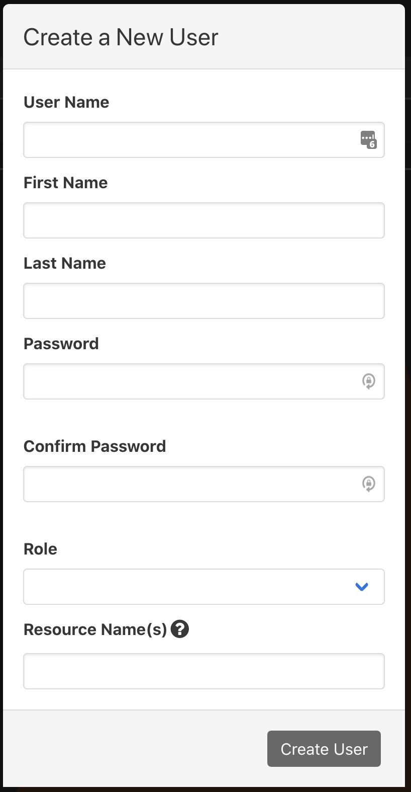
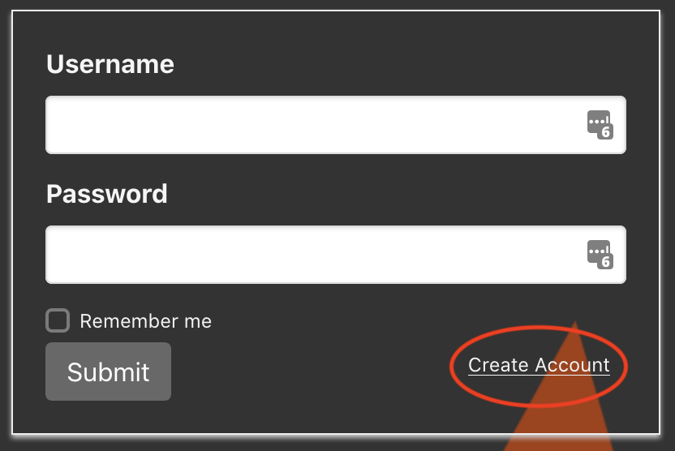
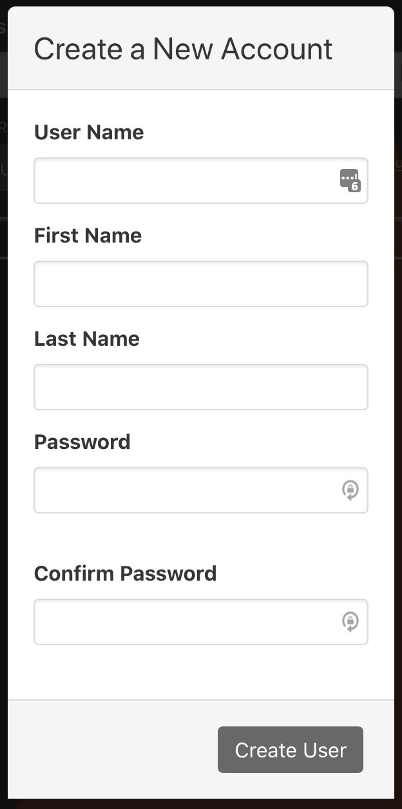

# Users and Authentication

phēnix authenticates users of its web UI and API, and uses role-based access
control (RBAC) to decide what each user can do. This page covers the
authentication modes, creating and managing users, signing in, and API tokens.
What each role and permission allows is described in
[Roles and Permissions](roles-and-permissions.md).

## Authentication Modes

phēnix has three authentication modes: `disabled`, `enabled`, and `proxy`. The
mode is set in two places, which must agree:

* **The web UI build**, with `VITE_AUTH` set to `disabled`, `enabled`, or
  `proxy`. When building the Docker image, set the `PHENIX_WEB_AUTH` build
  arg, which defaults to `disabled`. A local UI build (`npm run build` or
  `make build`) defaults to `enabled`. The JIT image reads `PHENIX_WEB_AUTH`
  when the container starts instead.
* **The `phenix ui` server**, with the JWT signing key. Set it with
  `-k/--jwt-signing-key`, the `PHENIX_UI_JWT_SIGNING_KEY` environment
  variable, or `ui.jwt-signing-key` in the
  [phēnix config file](settings.md#configuration-files).

### `disabled` Mode

No authentication or authorization happens. Users don't sign in, and every
request acts as a Global Admin.

Build the UI with `VITE_AUTH=disabled`, and start `phenix ui` without a signing
key in any of the three places above.

### `enabled` Mode

Users sign in to phēnix with a username and password, and their role decides
what they can do.

Build the UI with `VITE_AUTH=enabled`, and start `phenix ui` with a secret
signing key:

```shell
phenix ui --jwt-signing-key <secret>
```

The key must not be `proxy-jwt` and must not start with `dev|`, because those
values select other modes.

Signing in gives the user a session token that is valid for `--jwt-lifetime`
(`PHENIX_UI_JWT_LIFETIME`, `ui.jwt-lifetime`), a Go duration that defaults to
`24h`.

### `proxy` Mode

A reverse proxy in front of phēnix authenticates users, and phēnix still
decides what each user can do. Build the UI with `VITE_AUTH=proxy`. The server
supports two setups:

* **Username header.** Start `phenix ui` with a secret signing key and
  `--proxy-auth-header <header>` (`PHENIX_UI_PROXY_AUTH_HEADER`), for example
  `--proxy-auth-header X-phenix-user`. The proxy adds that header, containing
  the authenticated username, to every request. phēnix trusts the header: the
  UI signs the user in without a password, and every API request must carry
  the header with the same username as its token.
* **Proxy-issued token.** Start `phenix ui` with `--jwt-signing-key proxy-jwt`.
  The proxy sends a JWT for the user as `X-Phenix-Auth-Token: Bearer <jwt>`,
  and phēnix reads the username from its `sub`, `username`, or `user` claim.
  phēnix does not verify the token's signature. A token is accepted only after
  it has been registered by calling `GET /api/v1/login` with it, which the UI
  does when it signs in; scripts must do the same. phēnix keeps one
  proxy-issued token per user.

!!! warning
    In `proxy` mode, phēnix trusts the proxy completely. Make sure clients can
    only reach phēnix through the proxy, and that the proxy removes any
    username header or `X-Phenix-Auth-Token` header sent by the client.

Each proxy user needs a phēnix user with the same username. Create them ahead
of time, as described in [Creating Users](#creating-users); their passwords are
not used in `proxy` mode. A user without a phēnix account is sent to a sign-up
form, but that form sends no password and so fails the
[password requirements](#password-requirements).

In `proxy` mode, the UI header shows `Reauthorize` instead of `Logout`.

## The First Administrator

If no users are configured in [`ui.users`](#from-configuration-uiusers),
`phenix ui` creates a Global Admin user named `admin@foo.com` with the password
`foobar` when it starts.

!!! warning
    Configure your own administrator in `ui.users` before exposing phēnix. If
    `admin@foo.com` was already created, delete it from the `Users` tab after
    signing in as your own administrator.

## Creating Users

Every user has exactly one role, and a user with an unknown role is never
created. phēnix can create users in three ways.

### From the Users Tab

A user with the `users` `create` permission can click the `+` button on the
`Users` tab and fill in:

* `User Name`, `First Name`, `Last Name`, `Password`, and `Confirm Password`.
  The password must meet the [password requirements](#password-requirements).
* `Role`: the user's role. See [Built-In Roles](roles-and-permissions.md#built-in-roles).
* `Resource Name(s)`: optional, space-separated names that limit the role to
  certain experiments. See
  [Scoping a Role to Experiments](roles-and-permissions.md#scoping-a-role-to-experiments).

{: width=400 .center}

The same can be done with the API: `POST /api/v1/users` with `username`,
`password`, `first_name`, `last_name`, `role_name`, and `resource_names`.
Creating a user with a role that doesn't exist returns an error, and creating
a user whose name is taken returns `409 Conflict`.

### From Configuration (`ui.users`)

When `phenix ui` starts, it creates the users listed in the `ui.users`
setting. Each entry has this format:

```text
<username>:<password>:<role>[:<resource name>...]
```

* `<role>` is a role's display name, such as `Experiment User`, or its config
  name, such as `experiment-user`.
* Any fields after the role are resource names that limit the role to certain
  experiments, for example `alice:<password>:Experiment User:exp-a:exp-a/*`.
  See [Scoping a Role to Experiments](roles-and-permissions.md#scoping-a-role-to-experiments).

`ui.users` can be set in any of these places:

* A `users` config file, such as `users.yml`, in the current directory,
  `~/.config/phenix` (when not running as root), or `/etc/phenix`:

    ```yaml
    ui:
      users:
        - admin:<password>:Global Admin
        - alice:<password>:Experiment User:exp-a:exp-a/*
    ```

* `ui.users` in the [phēnix config file](settings.md#configuration-files).
* The `--users` flag, with entries separated by commas or given by repeating
  the flag.
* The `PHENIX_UI_USERS` environment variable, with entries separated by
  spaces. Role display names contain spaces, so use config names such as
  `global-admin` here.

These sources don't combine: the `--users` flag wins over `PHENIX_UI_USERS`,
which wins over the config files, and a `users` file overrides `ui.users` in
the phēnix config file.

phēnix reads `ui.users` only when `phenix ui` starts, so restart it after
changing the list. For each entry:

* If the user doesn't exist, phēnix creates it. Entries whose role doesn't
  exist are skipped and logged.
* If the user exists and its role is not the one listed, phēnix assigns the
  listed role and resource names, which undoes role changes made on the
  `Users` tab. The comparison uses the role's display name, so an entry that
  uses a config name, such as `experiment-user`, reassigns the role and its
  resource names at every start. Changing only an entry's resource names does
  not update an existing user.
* Passwords of existing users are never changed.

Passwords in `ui.users` don't have to meet the password requirements and can't
contain `:`. Users created this way can view their own user, but can't change
their own password or create their own API tokens unless their role allows it.

### Self Sign-Up

In `enabled` mode, the sign-in page has a `Create Account` button that opens a
`Create a New Account` dialog. It asks for a user name, first name, last name,
and password.

{: width=400 .center}

{: width=400 .center}

The new account gets the `Disabled` role and is signed in, but can't do
anything until an administrator assigns it a role on the `Users` tab.
phēnix doesn't notify administrators; the new account appears on the `Users`
tab with the `Disabled` role after the page is refreshed. Anyone who can reach
the sign-in page can create a `Disabled` account.

### Password Requirements

By default, passwords must be at least 8 characters long and contain a
lowercase letter, a number, and a symbol. Uppercase letters are not required.
Change these under `Settings` > `Password Settings`, which needs the
[`settings`](roles-and-permissions.md#resource-settings) `update` permission.
The minimum length can be set from 8 to 32.

The requirements apply to users created from the `Users` tab, the API, and self
sign-up, and to password changes. They don't apply to users created from
`ui.users`.

## Signing In

Sign in on the phēnix sign-in page with a username and password.

* `Remember me` keeps the session in the browser's local storage, so it
  survives new tabs and browser restarts. Without it, the session lasts only
  in the current tab.
* The session ends when its token expires (`--jwt-lifetime`, `24h` by
  default), and the UI asks the user to sign in again.
* `Logout` in the header ends the session and revokes its token on the server.
* phēnix can also sign out idle users; see
  [Web UI Session Timeout](settings.md#web-ui-session-timeout).

To sign in from a script, call `POST /api/v1/login` with a JSON body of
`{"user": "<username>", "pass": "<password>"}`, or `GET /api/v1/login` with
HTTP basic authentication. The response's `token` is valid for
`--jwt-lifetime`:

```shell
TOKEN=$(curl -s -X POST -d '{"user":"alice","pass":"<password>"}' \
  https://phenix.example.com/api/v1/login | jq -r .token)

curl -H "X-Phenix-Auth-Token: Bearer $TOKEN" \
  https://phenix.example.com/api/v1/experiments
```

## API Tokens

For scripts and integrations, create a longer-lived API token:

1. On the `Users` tab, click the key icon (`create new user token`) next to the
   user. This needs the [`users`](roles-and-permissions.md#resource-users)
   `patch` permission for that user, which users created from the `Users` tab
   have for themselves. A token for another user also needs
   [`users/tokens`](roles-and-permissions.md#resource-userstokens) `create`,
   which only Global Admin has by default.
2. Enter a `Description` and a `Lifetime (days)`. The lifetime is a number of
   days, such as `180`, or a Go duration, such as `4320h`.
3. Click `Create Token`. The token and its expiration are shown once, so copy
   the token before closing the dialog.

Send the token in the `X-Phenix-Auth-Token` header, prefixed with `Bearer`:

```http
X-Phenix-Auth-Token: Bearer <token>
```

The header name and `Bearer` are not case-sensitive. A token without the
`Bearer` prefix is rejected with `401 Unauthorized`. In `enabled` mode, where
a header can't be set, such as in a link, the token can be passed as a `token`
query parameter instead.
In `proxy` mode with a username header, API requests also need that header.

phēnix doesn't show a user's tokens, including through the configs API. To
revoke a token, call `GET /api/v1/logout` with it. Deleting a user revokes all
of the user's tokens, and changing the signing key revokes every token.

## Managing Users

### Editing Users

On the `Users` tab, click a username or its pencil icon to open the
`User <name>` dialog, which has `First Name`, `Last Name`, `Password`,
`New Password`, `Role`, and `Resource Name(s)`.

* To change a password, enter the current password in `Password` and the new
  one in `New Password`. This is required even for administrators, so to reset
  a forgotten password, delete and recreate the user, which also resets its
  role and revokes its tokens.
* Changing `Role` and `Resource Name(s)` needs the
  [`users/roles`](roles-and-permissions.md#resource-usersroles) `patch`
  permission for the user, in addition to `users` `patch`; without it, those
  changes are ignored. The UI only shows these fields to users with `users`
  `create`, and doesn't let users change their own role.
* A user whose role changes should sign out and back in, because the UI keeps
  the role it received at sign in.
* Assigning a role copies the role's current policies into the user, which is
  also how changes to a role config reach users who already have it.
* Leaving `First Name` or `Last Name` blank keeps the current value.

### Deleting Users

Click the trash icon next to a user to delete it. This needs the
[`users`](roles-and-permissions.md#resource-users) `delete` permission, and
users can't delete themselves. Deleting a user revokes all of the user's API
tokens.

## Roles and Permissions

Roles, the permissions they grant, and how to scope them to experiments are
described in [Roles and Permissions](roles-and-permissions.md).
